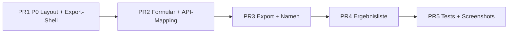

# Playlist-Generierung v1 — Umsetzungsplan (React)

Status: Geplant  
Datum: 2026-07-02  
Basis: [`playlist-generierung-anforderungen.md`](playlist-generierung-anforderungen.md) (Interview abgeschlossen)  
Design-Review: [`playlists-evaluierung-2026-06-30.md`](playlists-evaluierung-2026-06-30.md)

**Ziel:** Die Live-Playlist-Seite (`/playlists`, React) von einem funktionalen Export-Werkzeug zu einem **natürlichen Abschluss** der Entdeckungsreise machen — Funktion zuerst, Design im Dienst der Funktion. **Nur React**; Streamlit bleibt Referenz.

**Nicht in v1:** Auto-Versand, gespeicherte Playlists, Favoriten als Quelle, direkte Streaming-APIs, Mindest-Score-Slider, Highlight-Badge, Vorschau vor Generierung.

---

## Ist-Stand (kurz)

| Bereich | Heute | Gap |
|---------|--------|-----|
| Layout | 2-Spalten-Grid + `import-note`; Mobile-Überlappung | P0 |
| Formular | Selects, Number-Input, Fokus-Dropdown, Archiv-Abwechslung-Slider | Modus-UI, Chips, Slider Fokus↔Entdecken, Archiv-Pool |
| API | `POST /v1/playlists/export`; `archive_limit` default 200 | `pool_size` aus Archiv-`total`; Mapping UI→`taste_exponent` / `selection_strategy` |
| Export | TXT-Request; clientseitiges CSV ohne Playlist-Name | CSV primär, Backend-CSV, TuneMyMusic-Anleitung |
| Ergebnis | HTML-Tabelle | Hybrid-Zeilen, Fotos, Review-Link |
| Namen | `Plattenradar YYYY-MM-DD` | Modus + Datum + Suffix `(2)` |

**Hauptdateien:** `frontend/src/components/PlaylistGenerator.tsx`, `frontend/src/lib/playlistExport.ts`, `frontend/src/styles/global.css`, ggf. neue Komponenten unter `frontend/src/components/playlist/`.

---

## PR-Strategie

Fünf **kleine, reviewbare PRs** in Abhängigkeitsreihenfolge. Jede PR ist deploybar; spätere PRs bauen auf früheren auf.

---

## PR 1 — P0: Mobile-Layout & Export-Shell

**Ziel:** Blocker beheben; leere „Danach“-Sidebar entfernen; Export-Bereich strukturell vorbereiten.

### Aufgaben

1. **CSS** (`global.css`): `.playlist-page` ab Breakpoint (≤900px) **einspaltig**; `import-note` nicht als feste Sidebar.
2. **Komponente:** `import-note` nur **vor** Generierung als einzeiliger Hinweis unter dem Button *oder* ganz entfernen; **nach** Generierung ausblenden.
3. **Ergebnis-Container:** `playlist-results` volle Breite; Export-Aktionen in eigener Leiste oben (Platzhalter-Buttons ok).
4. **Visueller Check:** Mobile 390px + Desktop 1440px (manuell oder Screenshot).

### Akzeptanzkriterien

- [ ] Keine Überlappung Formular / Sidebar auf 390px
- [ ] Nach Generierung keine redundante „Danach“-Box
- [ ] Bestehende Generierung + Export weiter funktionsfähig

### Tests

- Optional: Playwright-Screenshot `playlists-formular-mobile` ohne Überlappung (kann in PR 5 nachziehen)

### Aufwand

Klein (überwiegend CSS + leichte JSX-Umordnung)

---

## PR 2 — P1: Formular, Modus-Steuerungen & API-Mapping

**Ziel:** Interview-Entscheidungen im Formular; Archiv-Pool adaptiv; Backend-Parameter korrekt befüllen.

### Aufgaben

#### UI

1. **Moduswahl:** Zwei Karten/Tabs „Neuheiten“ / „Archiv“ statt Select (nur passende Felder je Modus).
2. **Neuheiten:** Update-Runden-Dropdown (Default **1**); Slider **Fokus ↔ Entdecken** (ersetzt Fokus-Dropdown).
3. **Archiv:** Beim Moduswechsel `loadArchiveRecommendations(profile, { limit: 1 })` → `total` als `pool_size`.
   - Slider „Top-Alben“: `min(20, pool)` … `pool_size`, Default `min(200, pool)`.
   - Chips **50 · 200 · Alle** (relativ, disabled wenn Pool kleiner).
   - Kontextzeile: *„Top 200 von 347 passenden Alben“*.
   - Zweiter Slider **Breit streuen ↔ Alben vertiefen** (eigene Labels).
4. **Track-Anzahl:** Chips **20 · 30 · 50** (Default 30); optional „Eigene Anzahl“ (5–100).
5. **Profil-Zeiler:** *„Basierend auf deinem Musikprofil“* + Link Profil bearbeiten.
6. **Deep-Link:** Bei Sprung von Aktuell/Entdecken Quelle + Zeitraum vorausgefüllt + kurze Kontextzeile (z. B. in `App.tsx` / Props).

#### API-Mapping (`playlistExport.ts`)

| UI | API |
|----|-----|
| Fokus ↔ Entdecken (Neuheiten) | `taste_exponent` 1.0 … 3.0; `selection_strategy`: stratified (entdecken) / weighted_sample (fokus) — Feintuning an bestehende Pipeline anpassen |
| Breit ↔ Vertiefen (Archiv) | Variation auf `taste_exponent` + `selection_strategy` (analog Streamlit-Logik) |
| Archiv Top-N | `archive_limit` = Slider-Wert |
| Update-Runden | `update_rounds` (unverändert) |

7. **Neue Hilfsfunktionen** in `playlistExport.ts` (rein, testbar): `defaultPlaylistNameForSource`, Mapping-Slider → Exponent.

### Akzeptanzkriterien

- [ ] Archiv-Slider-Maximum = tatsächlicher `total` aus API
- [ ] Nur modus-relevante Felder sichtbar
- [ ] Default Update-Runden = 1; Default Tracks = 30; Default Archiv = min(200, pool)

### Tests

- `frontend/src/lib/playlistExport.test.ts`: Slider-Mapping, `archive_limit`, Default-Namen (Grundlage PR 3)
- Unit-Tests für `min(200, pool)`-Logik

### Risiken

- **Per-Album-Cap (~4):** Falls bestehende `taste_exponent`/`selection_strategy`-Kombination nicht reicht → kleines Backend-Feld `max_tracks_per_album` in `playlist_builder.py` (optionaler PR-2b).

### Aufwand

Mittel

---

## PR 3 — P1: Playlist-Namen, Export & „Nochmal mischen“

**Ziel:** CSV als Primärweg; korrektes TuneMyMusic-Format; generische Anleitung; Idempotenz-Namen.

### Aufgaben

1. **Default-Namen:** `Plattenradar Neuheiten YYYY-MM-DD` / `Plattenradar Archiv YYYY-MM-DD` bei Moduswechsel (wenn Nutzer nicht manuell editiert hat).
2. **Suffix `(2)`:** Bei erneuter Generierung mit unverändertem Basisnamen Zähler erhöhen.
3. **API-Request:** `format: "csv"` als Primärantwort **oder** paralleler Abruf; TXT für Copy-Feld weiterhin verfügbar (Backend liefert beides in `PlaylistResult` — ggf. nur ein Request mit `format` und zweites Format aus Response-Struktur prüfen).
4. **CSV-Download:** **Backend-`csv_export`** nutzen (`Track name`, `Artist name`, `Playlist name`) — `playlistItemsToCsv` entfernen/deprecated.
5. **Export-Hierarchie:**
   - Primär: **Als CSV herunterladen**
   - Sekundär: Text kopieren, TXT herunterladen
   - Hinweis: *„CSV = Name automatisch · Text = Name in TuneMyMusic“*
6. **TuneMyMusic:** Aufklappbarer Block mit nummerierten Schritten + Link `https://www.tunemymusic.com` (generisch, dienstneutral).
7. **„Nochmal mischen“:** Sekundärbutton im Ergebnis — gleiche Options, neuer API-Call, Name-Suffix-Logik beachten.

### Akzeptanzkriterien

- [ ] CSV enthält Spalte `Playlist name` mit Nutzernamen
- [ ] Zweite Generierung am selben Tag → `… (2)` im Default-Namen
- [ ] „Nochmal mischen“ erzeugt neue Trackliste ohne Formular-Reset

### Tests

- `playlistExport.test.ts`: CSV nicht mehr clientseitig falsch formatiert
- API-Integrationstest unverändert grün (`tests/music_review/api/test_app.py`)

### Aufwand

Mittel

---

## PR 4 — P1: Ergebnisdarstellung (Hybrid-Zeilen)

**Ziel:** Freude & Anbindung an Aktuell/Entdecken; Export bleibt oben.

### Aufgaben

1. **Neue Komponente** `PlaylistTrackRow.tsx` (oder ähnlich):
   - Kleines Künstlerfoto (bestehende Thumbnail-URL-Logik aus Empfehlungen)
   - Künstler, Album, Titel
   - Review-Link als dezentes Icon (URL aus `review_id` / API-Feld falls nötig)
2. **Kontextzeile** unter Playlist-Titel: z. B. *„30 Titel · Neuheiten · letzte 4 Runden · Fokus auf deinen Geschmack“* — aus Formular-State generiert.
3. **Künstler-Mosaik** (optional): 6–12 eindeutige Künstlerfotos oben — **nur** wenn ≥6 Bilder verfügbar; sonst weglassen.
4. **HTML-Tabelle entfernen**; Export-Leiste bleibt erste Interaktion im Ergebnisblock.
5. **Warnung** bei weniger Tracks als gewünscht: prominenter + Hinweis („Zeitraum erweitern“ / „Top-Alben erhöhen“).

### API-Ergänzung (falls nötig)

- `PlaylistExportItem` um `review_url` oder `artist_image_url` erweitern, falls Frontend sie heute nicht hat — prüfen gegen `POST /v1/playlists/export` Response; ggf. kleine API-Erweiterung in `src/music_review/api/app.py`.

### Akzeptanzkriterien

- [ ] Keine rohe HTML-Tabelle mehr
- [ ] Jede Zeile: Künstler, Album, Titel, Review-Link
- [ ] Kein Highlight-Badge in v1
- [ ] Mosaik nur bei genügend Bildern

### Aufwand

Mittel bis groß

---

## PR 5 — Tests, Lint & visuelle Regression

**Ziel:** Qualität absichern; Mobile-Regression verhindern.

### Aufgaben

1. `hatch run frontend-test` — Unit-Tests für `playlistExport`, ggf. neue Komponenten-Tests.
2. `hatch run lint:all` — Frontend + Python unverändert grün.
3. Playwright: Referenz-Screenshots Playlists (Formular Desktop/Mobile, Ergebnis) in `frontend/tests/visual/` — analog Aktuell/Entdecken.
4. Dokumentation: Screenshots in `docs/playlists-evaluierung-2026-06-30/` aktualisieren.

### Akzeptanzkriterien

- [ ] CI grün (lint + frontend-test)
- [ ] Mobile-Formular-Screenshot ohne Überlappung

### Aufwand

Klein bis mittel

---

## Nice-to-have (nach v1)

| Item | Priorität |
|------|-----------|
| Pool-Hinweis Neuheiten vor Generierung | P2 |
| Vorschau Mini-Kacheln vor Klick | P2 |
| Rating in Track-Zeile | P2 |
| `max_tracks_per_album` explizit im API | Nur wenn PR-2-Mapping unzureichend |
| Mindest-Score Archiv | Später |

---

## Abhängigkeiten & Reihenfolge

| PR | Blockiert durch | Kann parallel zu |
|----|-----------------|------------------|
| PR1 | — | — |
| PR2 | PR1 (Layout-Shell) | — |
| PR3 | PR2 (Formular-State, Mapping) | — |
| PR4 | PR3 (Export oben im Ergebnis) | API-Felder für Bilder früh klären |
| PR5 | PR4 | — |

**Empfohlene Merge-Reihenfolge:** PR1 → PR2 → PR3 → PR4 → PR5.

---

## Verifikation (gesamt v1)

Manuell nach PR5:

1. Ohne Profil → Gate + CTA
2. Neuheiten: 1 Runde, Fokus↔Entdecken, 30 Tracks → Generieren → CSV → TuneMyMusic-Text verständlich
3. Archiv: Pool-Slider, Top 200/Alle, Breit/Vertiefen → Generieren → „Nochmal mischen“
4. Zweite Generierung gleicher Tag → Name ` (2)`
5. Mobile 390px: bedienbar, kein Overlap
6. Sprung von Aktuell → Playlists: Quelle/Zeitraum sichtbar vorausgefüllt

Cloud-Agent-Hinweis: Volle Verifikation mit Produktionsdaten lokal/auf Server; Tests mit Fixtures/Mocks.

---

## Changelog

| Datum | Inhalt |
|-------|--------|
| 2026-07-02 | Erstfassung aus abgeschlossenem Interview und Design-Review |
