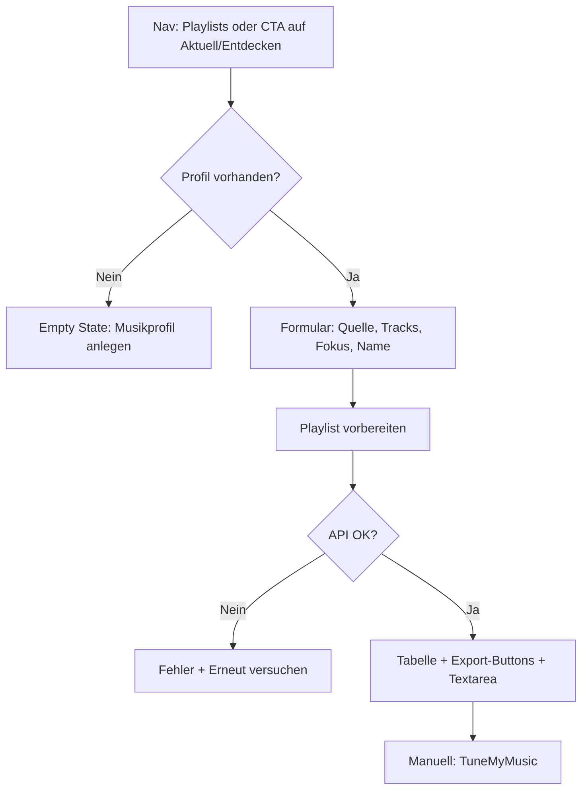

# Plattenradar: Playlist-Seite — Evaluierung

Status: Abgeschlossene Review  
Datum: 2026-06-30  
Basis: React-Frontend (`/playlists`) mit Visual-Fixture-API (`http://127.0.0.1:8010`), temporärem Musikprofil und Screenshots unter [`playlists-evaluierung-2026-06-30/`](playlists-evaluierung-2026-06-30/)

Dieses Dokument vertieft den kurzen Playlists-Abschnitt in
[`plattenradar-design-evaluierung-2026-06-28.md`](plattenradar-design-evaluierung-2026-06-28.md).
Dort steht die Einordnung im Gesamtprodukt; hier steht eine **seitenweise**
Bewertung mit konkreten Umsetzungsvorschlägen nach Priorität.

Ergänzend: Die Streamlit-Variante (`pages/playlist_section.py`) dient als
funktionaler Referenzpunkt — einige UX-Details sind dort schon ausgereifter.

---

## Methodik

- Code-Review: `PlaylistGenerator.tsx`, `global.css` (`.playlist-page`), API
  (`POST /v1/playlists/export`), Einbindung in `App.tsx` und
  `RecommendationList.tsx`
- Screenshots Desktop (1440×900) und Mobile (390×844) für:
  - leerer Zustand ohne Profil
  - Formular (Neuheiten / Archiv)
  - Ergebnisansicht nach Generierung
- Bewertung aus Produktsicht: Verständlichkeit, Motivation, Export-Flow,
  visuelle Anbindung an Aktuell/Entdecken, Mobile-Tauglichkeit
- Nicht bewertet: TuneMyMusic-Qualität der Track-Matches, Deezer/Spotify-APIs,
  vollständiges Accessibility-Audit

### Screenshot-Dateien

| Datei | Inhalt |
|-------|--------|
| [`playlists-ohne-profil-desktop.png`](playlists-evaluierung-2026-06-30/playlists-ohne-profil-desktop.png) | Gate ohne Musikprofil |
| [`playlists-formular-desktop.png`](playlists-evaluierung-2026-06-30/playlists-formular-desktop.png) | Formular, Quelle „Neuheiten“, leere „Danach“-Spalte |
| [`playlists-archiv-formular-desktop.png`](playlists-evaluierung-2026-06-30/playlists-archiv-formular-desktop.png) | Formular, Quelle „Archiv“, inkl. Abwechslungs-Slider |
| [`playlists-ergebnis-desktop.png`](playlists-evaluierung-2026-06-30/playlists-ergebnis-desktop.png) | Ergebnis mit Tabelle, Export-Buttons, TuneMyMusic-Textarea |
| [`playlists-formular-mobile.png`](playlists-evaluierung-2026-06-30/playlists-formular-mobile.png) | Mobile: **Layout-Überlappung** Formular / „Danach“ |
| [`playlists-ergebnis-mobile.png`](playlists-evaluierung-2026-06-30/playlists-ergebnis-mobile.png) | Mobile: Ergebnisblock unter dem Formular |

---

## Gesamteindruck

Die Playlist-Seite erfüllt ihren **Kernauftrag**: Aus dem personalisierten Pool
(Neuheiten oder Archiv) eine exportierbare Titelliste erzeugen und für
TuneMyMusic bereitstellen. Technisch ist das sauber an die API angebunden;
Copy und Typografie passen zur restlichen Plattenradar-Sprache.

Gleichzeitig fühlt sich die Seite im Vergleich zu **Aktuell** und **Entdecken**
wie ein **älteres Werkzeug** an: Formular links, leerer Platzhalter rechts,
Ergebnis als schlichte HTML-Tabelle. Der visuelle und narrative Gewinn der
Highlight-Kacheln, Rank-Lead und Passungs-Begründungen kommt hier kaum an.

Der größte akute Bruch: **Mobile-Layout**. Auf 390px Breite überlagern sich
Formular und „Danach“-Karte — die Seite ist in diesem Zustand praktisch
unbenutzbar.

---

## Funktionale Bewertung

### Was funktioniert gut

| Aspekt | Befund |
|--------|--------|
| Profil-Gate | Ohne Musikprofil klare Meldung + CTA „Musikprofil anlegen“ |
| Quellenwahl | Neuheiten vs. Plattentests-Archiv; bei Neuheiten zusätzlich Zeitraum |
| Archiv-Feintuning | Abwechslungs-Slider nur bei Archiv — sinnvolle Reduktion |
| API-Anbindung | Synchroner Export über `POST /v1/playlists/export`; Fokus/Variation werden in `taste_exponent` und `selection_strategy` übersetzt |
| Kontext aus Empfehlungsseiten | `createPlaylist(source)` setzt Quelle und `updateRounds` beim Sprung von Aktuell/Entdecken |
| Export | Kopieren, TXT, CSV; Freitext-Textarea für TuneMyMusic |
| Fehlerbehandlung | Alert mit „Erneut versuchen“; Warnung bei weniger Tracks als gewünscht |
| Default-Name | `Plattenradar YYYY-MM-DD` — nachvollziehbar |

### Schwächen und Lücken

| Aspekt | Befund |
|--------|--------|
| Kein Ergebnis-Kontext | Tracks erscheinen ohne Rating, Passung, Highlight-Markierung, Review-Link |
| Keine Quellen-Spalte | Streamlit zeigt „Highlight“ vs. „Albumtrack“ (`source_kind`); React-Tabelle nicht |
| Export-Anleitung dünn | Streamlit hat nummerierte TuneMyMusic-Schritte + Deezer-Direktlink; React nur Kurztext in „Danach“ |
| Formular vs. Profil | Aktive Filter/Presets des Musikprofils sind auf der Playlist-Seite nicht sichtbar |
| Keine Vorschau | Erst nach Klick auf „Playlist vorbereiten“ sieht man, was rauskommt |
| Kein Regenerieren leicht erreichbar | Neue Ziehung erfordert erneuten Button-Klick; kein „Nochmal mischen“ |
| Track-Anzahl | Number-Input 5–100; Streamlit nutzt Slider 5–50 — unterschiedliche Defaults/UX |
| Geschmacks-Orientierung | Streamlit: „gar nicht / etwas / mittel / stark“; React: „Fokus“ + Archiv-Abwechslung — für Nutzer schwer vergleichbar |
| Ergebnis-Persistenz | Session-only; Reload verwirft die Liste (akzeptabel, aber nicht kommuniziert) |

### User Flow (Ist)

Der Flow ist **linear und korrekt**, endet aber bewusst vor dem Musikdienst.
Die Reibung liegt vor allem in der **Erklärung des Exports** und der
**Ergebnisdarstellung**, nicht in der Generierung selbst.

---

## UI / UX-Bewertung

### Stärken

- **Verständliche Feldlabels** auf Deutsch („Musik auswählen aus“, „Fokus“,
  „Abwechslung“ mit Kurzhinweis beim Archiv)
- **Klare Primäraktion** — roter Button „Playlist vorbereiten“
- **Konsistente Shell** — Navigation, Papier-Hintergrund, Serif-Headline wie
  auf anderen Seiten
- **Zweispalten-Idee auf Desktop** — Formular vs. Hinweis „Danach“ ist
  grundsätzlich nachvollziehbar

### Schwächen

1. **„Danach“-Spalte motiviert nicht**  
   Rechts steht vor der Generierung nur Platzhaltertext. Kein Teaser („So könnte
   deine Liste aussehen“), keine Mini-Vorschau aus Highlights.

2. **„Danach“ bleibt nach Generierung stehen**  
   Nach dem Ergebnis steht unten/rechts weiterhin der gleiche Hinweis — obwohl
   die Liste bereits sichtbar ist. Redundant und leicht verwirrend.

3. **Ergebnis fühlt sich wie Admin-Tabelle an**  
   Keine Karten, keine Fotos, keine emotionale Bestätigung („Das passt zu dir“).
   Im Vergleich zu Aktuell/Entdecken wirkt das Ergebnis wie ein Debug-Output.

4. **CTA-Konkurrenz auf Neuheiten**  
   „Playlist aus Neuheiten vorbereiten“ steht im Briefing sehr prominent —
   kann vom eigentlichen Entdecken der Highlights ablenken (bereits in der
   Gesamt-Evaluierung angemerkt).

5. **Mobile: kritische Überlappung**  
   `.playlist-page` bleibt bei `max-width: 900px` ein Zwei-Spalten-Grid
   (`1fr` + `18rem`). Auf schmalen Viewports kollidieren Formular und
   `import-note` (siehe Mobile-Screenshot).

6. **Range-Slider „Abwechslung“**  
   Native Slider-Optik (blauer Thumb) bricht aus der sonst zurückhaltenden
   Plattenradar-Formensprache aus.

7. **Lange Ergebnisse auf Mobile**  
   Tabelle + Textarea erzeugen viel Scrollen; Export-Buttons umbrechen, aber
   ohne klare visuelle Hierarchie „zuerst exportieren, dann Details“.

---

## Layout- und Design-Bewertung

### Desktop (1440px)

| Element | Bewertung |
|---------|-----------|
| Seitenbreite (`max-width: 960px`) | Stimmig mit Rest der App |
| Header (Eyebrow + H1 + Intro) | Gut lesbar, etwas viel Weißraum darunter |
| Generator-Card | Funktional, aber „Setup-Panel“, nicht „Produktmoment“ |
| Grid 2-spaltig | Formular + schmale Sidebar — Sidebar zu leer im Idle-Zustand |
| Ergebnisblock | Volle Breite unter dem Grid — okay, aber visuell getrennt vom Formular |
| Tabelle | Klein (`0.88rem`), nüchtern, keine Zebra/Hover, keine Album-/Künstler-Spalten-Balance |

### Mobile (390px)

| Element | Bewertung |
|---------|-----------|
| Navigation | Wie auf anderen Seiten eng, aber noch lesbar |
| Zwei-Spalten-Grid | **Defekt** — Überlappung |
| Formularfelder | An sich touch-tauglich |
| Ergebnis | Stapelung funktioniert nach Generierung besser als der Idle-Zustand |

### Abstand zur Design-Linie von Aktuell/Entdecken

Aktuell/Entdecken transportieren **Kuration und Entdeckungsfreude** (Highlights,
Fotos, Passungstexte). Die Playlist-Seite transportiert **Datenexport**. Das
ist inhaltlich nachvollziehbar, wirkt im aktuellen UI aber wie ein
**Feature-Sprung**, nicht wie derselbe Produktstrang.

---

## Vergleich React vs. Streamlit (kurz)

| Punkt | React (`PlaylistGenerator`) | Streamlit (`playlist_section.py`) |
|-------|----------------------------|-----------------------------------|
| Geschmackssteuerung | Fokus + Abwechslung (Archiv) | Select-Slider „gar nicht … stark“ |
| Track-Anzahl | Number 5–100 | Slider 5–50 |
| Ergebnis-Tabelle | Künstler / Album / Track | + Spalte „Quelle“ (Highlight/Albumtrack) |
| Export-Hilfe | Kurztext + Textarea | Nummerierte TuneMyMusic-Schritte, Deezer-Link |
| Layout | 2-Spalten + Tabelle | Einspaltig, alles untereinander |
| Session | React State | `st.session_state` |

Für die React-Seite lohnt sich **selektives Übernehmen** der Streamlit-Export-
und Quellen-Transparenz, nicht das 1:1-Kopieren des Streamlit-Layouts.

---

## Offene Punkte / Entscheidungen

1. **Soll „Danach“ eine permanente Sidebar bleiben** oder nur vor der ersten
   Generierung / als aufklappbare Export-Hilfe erscheinen?
2. **Sollen Playlist-Treffer dieselben Karten wie Empfehlungen nutzen** (mit
   Foto, Rating, Link) — oder eine schlankere Track-Listen-Komponente?
3. **Wie stark soll die Seite Kontext aus der Quelle zeigen** (z. B. „Basierend
   auf 6 Neuheiten der letzten Update-Runde“ + Top-3-Preview)?
4. **Geschmacks-UI vereinheitlichen**: Fokus-Dropdown beibehalten oder an
   Streamlit-Orientierung angleichen?
5. **Sollen Playlists in der CI-Visual-Regression** mit abgedeckt werden (wie
   Aktuell/Entdecken)?
6. **Direktlinks** zu TuneMyMusic (Datei → Deezer) — rechtlich/UX okay?

---

## Empfohlene Maßnahmen (nach absteigender Priorität)

### P0 — Blocker / sofort

#### 1. Mobile-Layout reparieren

**Problem:** Zwei-Spalten-Grid auf schmalen Viewports → Überlappung (siehe
Mobile-Screenshot).

**Vorschlag:**

- Ab `max-width: 900px` (oder 720px): `grid-template-columns: 1fr`
- `import-note` unter das Formular stellen; optional vor Generierung als
  kompakten Hinweis-Block, nicht als gleichwertige Sidebar

**Aufwand:** Klein (CSS + kurzer visueller Check)

---

#### 2. „Danach“-Logik neu ordnen

**Problem:** Leerer Platzhalter vorher, redundanter Text nachher.

**Vorschlag:**

- **Vor Generierung:** Kurzer Inline-Hinweis unter dem Button oder eine Zeile
  im Formular („Export über TuneMyMusic — Anleitung nach der Generierung“)
- **Nach Generierung:** `import-note` ausblenden oder in einen aufklappbaren
  Block „So importierst du in Deezer/Spotify“ mit nummerierten Schritten
  verwandeln (Streamlit-Vorbild)
- Rechte Spalte im Idle-Zustand: optional **Mini-Preview** der letzten
  Highlights der gewählten Quelle statt leerer Box

**Aufwand:** Mittel

---

### P1 — Hoher Produktnutzen

#### 3. Ergebnisdarstellung an Empfehlungs-Design anbinden

**Problem:** Tabelle wirkt technisch; keine Verbindung zu Aktuell/Entdecken.

**Vorschlag:**

- Kompakte **Track-Liste** oder verkleinerte **Recommendation-Cards** (Künstler,
  Album, Track, optional Foto, Rating, `source_kind`-Badge „Highlight“)
- Playlist-Name als Editorial-Headline; darunter 1 Satz Kontext („30 Titel aus
  dem Archiv, Fokus: Top-Treffer“)
- Warnung bei weniger Tracks prominenter, mit Handlungsoption („Zeitraum
  erweitern“, „Fokus lockern“)

**Aufwand:** Mittel bis groß

---

#### 4. Export-Flow klarer machen (TuneMyMusic)

**Problem:** Nutzer müssen wissen, was nach dem Download passiert.

**Vorschlag:**

- Nummerierte Schritte wie in Streamlit
- Link zu TuneMyMusic (Datei-Upload / Freitext)
- Export-Buttons visuell gruppieren: primär „Text kopieren“, sekundär Downloads
- Nach „Text kopieren“: Bestätigung bleibt (`field-hint`), aber auffälliger
  (z. B. kurzer Success-Banner)

**Aufwand:** Klein bis mittel

---

#### 5. Quell-Kontext und Deep-Link von Aktuell/Entdecken stärken

**Problem:** Sprung von Empfehlungsseite setzt zwar `source`, zeigt das auf
der Playlist-Seite aber kaum an.

**Vorschlag:**

- Banner/Chips oben: „Aus deinen Neuheiten“ / „Aus dem Archiv“ + Zeitraum-Chip
- Optional: 3 Vorschau-Titel aus dem aktuellen Pool
- CTA-Text auf Aktuell/Entdecken harmonisieren (einheitlich „Playlist
  vorbereiten“)

**Aufwand:** Mittel

---

#### 6. Formular-Hilfen und Profil-Transparenz

**Problem:** „Fokus“ und „Abwechslung“ sind abstrakt; Filter des Profils unsichtbar.

**Vorschlag:**

- Kurze Hilfetexte unter „Fokus“ (wie beim Archiv-Slider)
- Chip-Zeile mit aktivem Preset / Filter-Summary (wie auf Entdecken)
- Track-Anzahl als Slider oder mit Presets (20 / 30 / 50) statt nacktem Number-Input

**Aufwand:** Klein bis mittel

---

### P2 — Qualität und Konsistenz

#### 7. Leerer Zustand ohne Profil aufwerten

**Problem:** Viel Weißraum, wenig Vorfreude.

**Vorschlag:** Kurzer Nutzen-Satz + 2-Schritte-Grafik (Profil → Playlist →
Musikdienst); optional Screenshot/Illustration

**Aufwand:** Klein

---

#### 8. `source_kind` und Metadaten in der Tabelle

**Vorschlag:** Spalte oder Badge „Highlight“ / „Albumtrack“; optional Score —
hilft beim Vertrauen in die Liste

**Aufwand:** Klein

---

#### 9. Visuelle Regression für Playlists

**Vorschlag:** Playwright-Referenzen für Formular Desktop/Mobile + Ergebnis (mit
Fixture/Mock), analog `live-screenshots.spec.ts`

**Aufwand:** Klein

---

#### 10. Form-Control-Styling vereinheitlichen

**Vorschlag:** Range-Slider an Plattenradar-Form-Styles anpassen (kein
System-Blau); Number-Input-Pfeile ggf. dezenter

**Aufwand:** Klein

---

### P3 — später / optional

| Maßnahme | Nutzen |
|----------|--------|
| „Nochmal mischen“ ohne Formular-Reset | Schnelleres Ausprobieren |
| Gespeicherte Playlists im Konto | Wiederkehrende Nutzer |
| Direkte Spotify/Deezer-API | Weniger Export-Reibung — hoher Implementierungs- und Rechtaufwand |
| Playlist aus Favoriten | Anbindung an Konto-Favoriten |

---

## Kurzfassung

Die Playlist-Seite ist **funktional solide**, aber **visuell und erlebnismäßig
hinter Aktuell/Entdecken zurück**. Die wichtigsten Hebel:

1. **Mobile-Layout fixen** (P0)
2. **„Danach“-Sidebar sinnvoll nutzen oder abschaffen** (P0)
3. **Ergebnis und Export emotional und erklärend gestalten** (P1)
4. **Kontext aus der Quelle sichtbar machen** (P1)

Damit wird aus einem Export-Werkzeug ein **natürlicher Abschluss** der
Entdeckungsreise — ohne die ehrliche TuneMyMusic-Zwischenstufe zu verstecken.

---

## Nächste sinnvolle Umsetzungsschritte (Vorschlag)

1. CSS-Fix Mobile + Snapshot `playlists-formular-mobile.png` erneut prüfen
2. `import-note`-Verhalten nach Generierung anpassen + TuneMyMusic-Schritte
3. Ergebnis-Liste mit `source_kind` und kompakterem Layout
4. Optional: Highlight-Preview in der Idle-Sidebar

Bei größeren Layout-Änderungen dieses Dokument und die Screenshots im
Unterordner aktualisieren.
